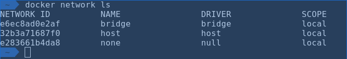

# Docker Deep Dive

---

## Andrew Pruski

### SQL Server DBA & Microsoft Data Platform MVP

@fa[twitter] @dbafromthecold  
@fa[envelope] dbafromthecold@gmail.com  
@fa[wordpress] www.dbafromthecold.com  
@fa[github] github.com/dbafromthecold

---

### Session Aim

To provide a deeper knowledge of the Docker platform

---

### Agenda

@ul
- Isolation 
- Networking 
- Storing images 
- Persisting data 
- Docker Compose 
- Non-root containers 
@ulend

---

### Isolation

---

### Networking

@ul
- bridge
- host
- null
@ulend

---

### Bridge network

Default network 
Represents docker0 network in the host network stack 
Containers can communicate with each other by IP address 
Supports port mapping 

---

### User defined networks

Enables DNS resolution of container names to IP addresses 
Docker provide default drivers for:- 
-bridge network 
-overlay network 
-MACVLAN network 
Containers can be connected to more than one network 
Containers can be connected/disconnected from networks without restarting 

---

### Registries

---

### Persisting data

---

### Docker Compose

---

### Non-root containers

---

### Resources

@size[0.8em](https://tinyurl.com/yyz8fe9x/DockerDeepDive) 
@size[0.8em](http://tinyurl.com/y3x29t3j/summary-of-my-container-series/)

