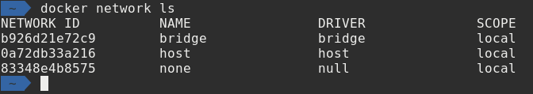
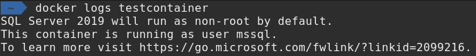

# Docker Deep Dive

---

## Andrew Pruski

### SQL Server DBA & Microsoft Data Platform MVP

@fa[twitter] @dbafromthecold  
@fa[envelope] dbafromthecold@gmail.com  
@fa[wordpress] www.dbafromthecold.com  
@fa[github] github.com/dbafromthecold

---

## Session Aim

To provide a deeper knowledge of the Docker platform

---

## Agenda

@ul
- Isolation 
- Networking 
- Persisting data 
- Docker Compose 
- Non-root containers 
@ulend

---

# Isolation

---

## Control Groups

Implements resource limiting of:-
- CPU
- Memory
- Disk IO

Ensures a single container cannot consume all 
resources of the host

---

## Namespaces

Processes within the container cannot see 
processes on the host or in other containers

---

## Union file system

@size[0.4em](https://docs.docker.com/v17.09/engine/userguide/storagedriver/imagesandcontainers/#container-and-layers)

---

# Demo

---

# Networking

---

## Default networks

- bridge 
- host 
- null 

---

## Bridge network

Default network 
Represents _docker0_ network in the host network stack 
Containers communicate by IP address 
Supports port mapping 

---

## User defined networks

@size[0.8em](Enables DNS resolution of container names to IP addresses )
@size[0.8em](Docker provide multiple drivers )
@size[0.8em](Can be connected to more than one network )
@size[0.8em](Connect/disconnect from networks without restarting )

---

# Demo

---

# Persisting data

---

## Options for persisting data

- Bind mounts 
- Named volumes 
- Data volume containers 

---

# Demo

---

# Docker Compose

---

## What is Compose?

@quote[Compose is a tool for defining and running multi-container Docker applications. With Compose, you use a YAML file to configure your application’s services. Then, with a single command, you create and start all the services from your configuration.](docs.docker.com/compose)

---

# Demo

---

# Non-root containers

---

## What user does SQL run as?

Before 2019, SQL ran as root within the container 
Now SQL runs as the MSSQL user 

---

# Demo

---

## Resources

@size[0.8em](https://tinyurl.com/yyz8fe9x/DockerDeepDive) 
@size[0.8em](http://tinyurl.com/y3x29t3j/summary-of-my-container-series/)

